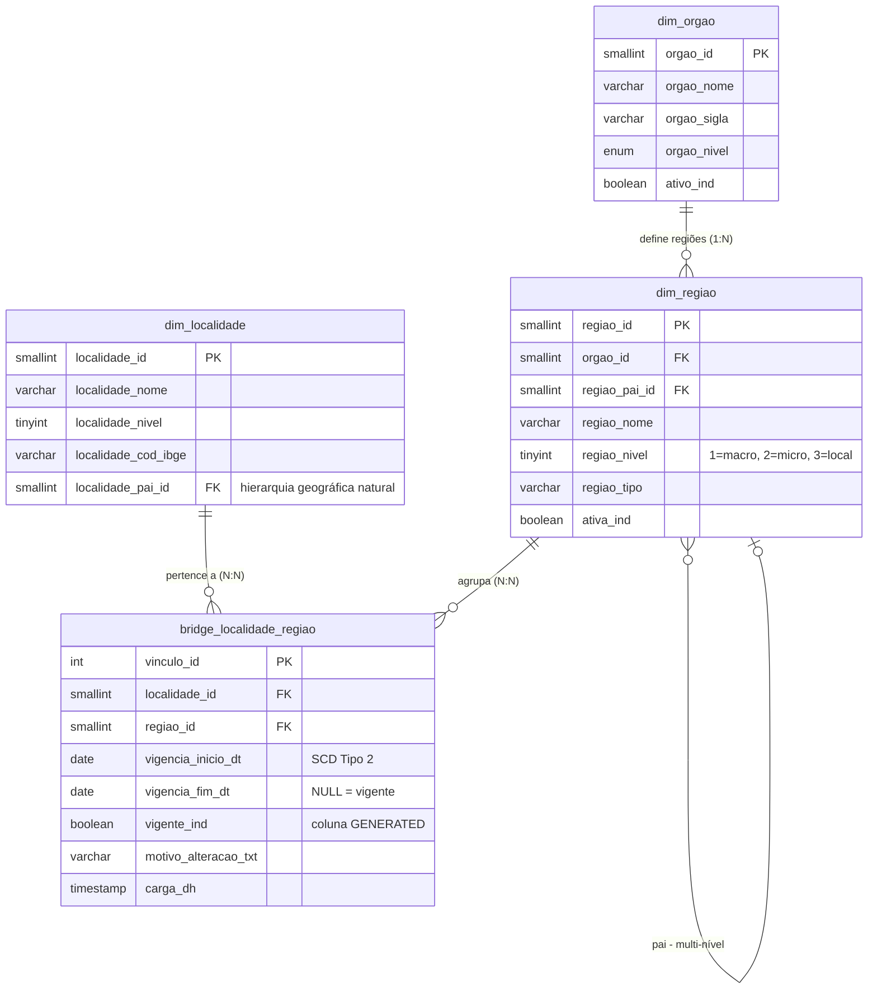
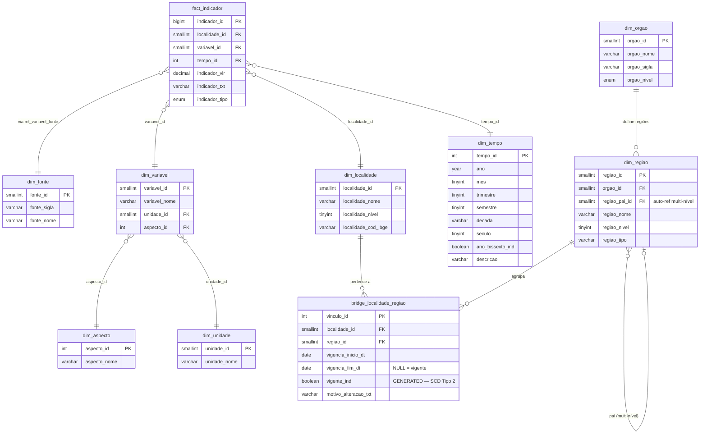

# 🗺️ Evolução do Modelo: Regiões de Trabalho por Órgão

**Data:** 25/02/2026  
**Contexto:** Limitações do modelo estrela puro para representar regiões de trabalho dinâmicas  
**Status:** Proposta de evolução

---

## 📋 Índice

1. [Problemática](#1-problemática)
2. [Limitações do Modelo Atual](#2-limitações-do-modelo-atual)
3. [Solução Proposta](#3-solução-proposta)
4. [Modelo de Dados](#4-modelo-de-dados)
5. [Scripts de Criação](#5-scripts-de-criação)
6. [Migração dos Dados Existentes](#6-migração-dos-dados-existentes)
7. [Consultas de Exemplo](#7-consultas-de-exemplo)
8. [Impacto no Modelo Estrela](#8-impacto-no-modelo-estrela)

---

## 1. Problemática

### 1.1 — Cenário de Negócio

No Estado de Goiás, **cada órgão define suas próprias regiões de trabalho** para agrupar municípios:

| Órgão | Tipo de Regionalização | Exemplo |
| ------- | ---------------------- | ------- |
| **Estado de Goiás** | Regiões de Planejamento | Região Metropolitana de Goiânia, Entorno do DF... |
| **Secretaria de Saúde** | Macrorregiões e Microrregiões de Saúde | Macro Centro-Oeste, Micro Goiânia... |
| **Secretaria de Segurança Pública** | Regiões Integradas de Segurança | RISP Capital, RISP Aparecida... |
| **Secretaria de Educação** | Subsecretarias Regionais | Subsecretaria de Anápolis... |

### 1.2 — Agravantes

1. **Múltiplas hierarquias simultâneas**: Um município pertence a UMA região de cada órgão, mas são regiões diferentes entre si
2. **Mudanças temporais**: Periodicamente, um município pode migrar da Região X para a Região Y dentro do mesmo órgão
3. **Histórico necessário**: Precisamos saber que "o município A pertencia à Região X até 2020, e a partir de 2021 passou para a Região Y"
4. **Regiões são multi-nível**: Saúde tem Macro → Micro → Município. Planejamento tem Região → Município

### 1.3 — Exemplo Concreto

```text
Município: Itaberaí (loc_cod = 52)

Em 2019:
  • Região de Planejamento (Estado):     Centro-Goiano
  • Macrorregião de Saúde:               Centro-Oeste
  • Microrregião de Saúde:               Goiânia
  • RISP (Segurança):                    RISP Anápolis

Em 2023 (após redistritamento):
  • Região de Planejamento (Estado):     Centro-Goiano        ← manteve
  • Macrorregião de Saúde:               Centro-Oeste         ← manteve
  • Microrregião de Saúde:               Inhumas              ← MUDOU!
  • RISP (Segurança):                    RISP Goiânia         ← MUDOU!
```

---

## 2. Limitações do Modelo Atual

### 2.1 — No banco original (`tb_localidade` + `tb_loc_pai`)

O modelo antigo usava duas abordagens **incompatíveis entre si**:

**Abordagem 1 — Colunas fixas em `tb_localidade`:**

```doc
loc_reg_plan              → Região de planejamento (Estado)
loc_reg_plan_macro_saude  → Macrorregião de saúde
loc_reg_plan_micro_saude  → Microrregião de saúde
```

**Problemas:**

- Cada nova regionalização exige `ALTER TABLE` para adicionar coluna
- Não há versionamento (perde-se o histórico quando muda)
- Segurança Pública, Educação e outros órgãos não têm colunas

**Abordagem 2 — `tb_loc_pai` (hierarquia genérica):**

```doc
loc_cod  → localidade
loc_pai  → localidade pai
loc_reg  → região (sem contexto de qual órgão)
```

**Problemas:**

- Não identifica **a qual órgão** aquela hierarquia pertence
- Se um município está em duas hierarquias diferentes, gera duplicata na PK
- Sem controle temporal

### 2.2 — No modelo estrela proposto

A `dim_localidade` atual absorveu os campos de região como colunas fixas:

```sql
regiao_planejamento_id   SMALLINT  -- fixo na dimensão
regiao_macro_saude_id    SMALLINT  -- fixo na dimensão
regiao_micro_saude_id    SMALLINT  -- fixo na dimensão
```

Isso cria um **modelo rígido** que:

- ❌ Não suporta novos órgãos sem DDL
- ❌ Não suporta histórico de mudanças
- ❌ Mistura atributos da localidade com atributos de vínculo organizacional
- ❌ Não permite consultas genéricas do tipo "mostre-me as regiões do órgão X"

---

## 3. Solução Proposta

### 3.1 — Conceito: Snowflake Parcial com SCD Tipo 2

A solução combina três técnicas:

1. **Snowflake parcial**: Criar dimensões separadas para `órgão` e `região`, conectadas via tabela bridge
2. **SCD Tipo 2** (Slowly Changing Dimension): Versionar os vínculos localidade↔região com `vigencia_inicio` e `vigencia_fim`
3. **Bridge Table**: Uma tabela ponte (`bridge_localidade_regiao`) que conecta localidade, região e órgão com temporalidade

### 3.2 — Diagrama Conceitual



> **Nota:** `dim_localidade` terá as colunas `regiao_planejamento_id`, `regiao_macro_saude_id` e `regiao_micro_saude_id` removidas após a migração para a bridge. O `localidade_pai_id` permanece para a hierarquia geográfica natural (Estado → Município).

### 3.3 — Por que não um modelo estrela puro?

| Aspecto | Estrela Pura | Snowflake Parcial (proposta) |
| --------- | ------------- | ------------------------------ |
| Consulta simples | ⭐ Mais rápida (menos JOINs) | ⚠️ 1-2 JOINs a mais |
| Novas regionalizações | ❌ Exige ALTER TABLE | ✅ Apenas INSERT |
| Histórico de mudanças | ❌ Impossível | ✅ SCD Tipo 2 nativo |
| Múltiplos órgãos | ❌ 1 coluna por órgão | ✅ N órgãos sem DDL |
| Complexidade de ETL | ⭐ Simples | ⚠️ Moderada |
| **Adequação ao negócio** | ❌ Insuficiente | ✅ **Completa** |

> 💡 O trade-off é aceitável: trocamos simplicidade de consulta por **flexibilidade de negócio** e **rastreabilidade histórica**, que são requisitos reais do sistema.

---

## 4. Modelo de Dados

### 4.1 — `dim_orgao` — Órgãos que definem regionalizações

| Coluna | Tipo | Descrição |
| -------- | ------ | ----------- |
| `orgao_id` | SMALLINT UNSIGNED AUTO_INCREMENT | PK |
| `orgao_nome` | VARCHAR(200) NOT NULL | Nome completo |
| `orgao_sigla` | VARCHAR(20) | Sigla |
| `orgao_nivel` | ENUM('estadual','secretaria','autarquia') | Nível institucional |
| `ativo_ind` | BOOLEAN DEFAULT TRUE | Está ativo? |
| `carga_dh` | TIMESTAMP DEFAULT CURRENT_TIMESTAMP | Data de carga |
| `atualizacao_dh` | TIMESTAMP DEFAULT CURRENT_TIMESTAMP ON UPDATE CURRENT_TIMESTAMP | Última atualização |

### 4.2 — `dim_regiao` — Regiões de trabalho (todas as regionalizações)

| Coluna | Tipo | Descrição |
| -------- | ------ | ----------- |
| `regiao_id` | SMALLINT UNSIGNED AUTO_INCREMENT | PK (surrogate) |
| `orgao_id` | SMALLINT UNSIGNED NOT NULL | FK → dim_orgao |
| `regiao_pai_id` | SMALLINT UNSIGNED NULL | FK → dim_regiao (auto-referência) |
| `regiao_nome` | VARCHAR(200) NOT NULL | Nome da região |
| `regiao_sigla` | VARCHAR(20) | Sigla |
| `regiao_nivel` | TINYINT UNSIGNED NOT NULL | Nível (1=macro, 2=micro, 3=local) |
| `regiao_tipo` | VARCHAR(50) | Tipo descritivo |
| `regiao_cod_externo` | VARCHAR(20) | Código em sistema externo |
| `ativa_ind` | BOOLEAN DEFAULT TRUE | Está ativa? |
| `carga_dh` | TIMESTAMP DEFAULT CURRENT_TIMESTAMP | Data de carga |
| `atualizacao_dh` | TIMESTAMP DEFAULT CURRENT_TIMESTAMP ON UPDATE CURRENT_TIMESTAMP | Última atualização |

### 4.3 — `bridge_localidade_regiao` — Vínculo com temporalidade (SCD Tipo 2)

| Coluna | Tipo | Descrição |
| -------- | ------ | ----------- |
| `vinculo_id` | INT UNSIGNED AUTO_INCREMENT | PK (surrogate) |
| `localidade_id` | SMALLINT UNSIGNED NOT NULL | FK → dim_localidade |
| `regiao_id` | SMALLINT UNSIGNED NOT NULL | FK → dim_regiao |
| `vigencia_inicio_dt` | DATE NOT NULL | Início da vigência |
| `vigencia_fim_dt` | DATE NULL | Fim da vigência (NULL = vigente) |
| `vigente_ind` | BOOLEAN GENERATED ALWAYS AS (vigencia_fim_dt IS NULL) STORED | Flag de conveniência |
| `motivo_alteracao_txt` | VARCHAR(500) | Motivo da mudança de região |
| `norma_legal_txt` | VARCHAR(200) | Decreto/Lei que definiu a mudança |
| `carga_dh` | TIMESTAMP DEFAULT CURRENT_TIMESTAMP | Data de carga |

### 4.4 — Regras de Integridade

1. **Unicidade temporal**: Para uma mesma combinação `(localidade_id, regiao.orgao_id, regiao.regiao_nivel)`, não pode haver sobreposição de vigência
2. **Vigente único**: Para cada `(localidade_id, orgao_id, regiao_nivel)`, no máximo 1 registro com `vigente_ind = TRUE`
3. **Fechamento**: Ao inserir um novo vínculo, o anterior deve ser encerrado (`vigencia_fim_dt = dia anterior`)

---

## 5. Scripts de Criação

### 5.1 — DDL das Novas Tabelas

```sql
-- =====================================================
-- EVOLUÇÃO DO MODELO: REGIÕES DE TRABALHO POR ÓRGÃO
-- =====================================================

SET FOREIGN_KEY_CHECKS = 0;

-- =====================================================
-- dim_orgao — Órgãos que definem regionalizações
-- =====================================================
CREATE TABLE IF NOT EXISTS dim_orgao (
    orgao_id SMALLINT UNSIGNED NOT NULL AUTO_INCREMENT
        COMMENT 'PK - Surrogate key',
    orgao_nome VARCHAR(200) NOT NULL
        COMMENT 'Nome completo do órgão',
    orgao_sigla VARCHAR(20) NULL
        COMMENT 'Sigla do órgão',
    orgao_nivel ENUM('estadual', 'secretaria', 'autarquia', 'federal', 'municipal') NOT NULL DEFAULT 'secretaria'
        COMMENT 'Nível institucional',
    ativo_ind BOOLEAN NOT NULL DEFAULT TRUE
        COMMENT 'Indica se o órgão está ativo',
    carga_dh TIMESTAMP NOT NULL DEFAULT CURRENT_TIMESTAMP
        COMMENT 'Data/hora da carga',
    atualizacao_dh TIMESTAMP NOT NULL DEFAULT CURRENT_TIMESTAMP ON UPDATE CURRENT_TIMESTAMP
        COMMENT 'Última atualização',
    
    PRIMARY KEY (orgao_id),
    UNIQUE KEY uk_orgao_nome (orgao_nome),
    INDEX idx_orgao_sigla (orgao_sigla)
    
) ENGINE=InnoDB DEFAULT CHARSET=utf8mb4 COLLATE=utf8mb4_unicode_ci
COMMENT='Dimensão Órgão - Órgãos que definem regionalizações de trabalho';


-- =====================================================
-- dim_regiao — Regiões de trabalho (todas as regionalizações)
-- =====================================================
CREATE TABLE IF NOT EXISTS dim_regiao (
    regiao_id SMALLINT UNSIGNED NOT NULL AUTO_INCREMENT
        COMMENT 'PK - Surrogate key',
    orgao_id SMALLINT UNSIGNED NOT NULL
        COMMENT 'FK - Órgão dono desta regionalização',
    regiao_pai_id SMALLINT UNSIGNED NULL
        COMMENT 'FK - Região pai (auto-referência para hierarquia multi-nível)',
    regiao_nome VARCHAR(200) NOT NULL
        COMMENT 'Nome da região',
    regiao_sigla VARCHAR(20) NULL
        COMMENT 'Sigla da região',
    regiao_nivel TINYINT UNSIGNED NOT NULL DEFAULT 1
        COMMENT 'Nível hierárquico (1=macro, 2=micro, 3=local, etc.)',
    regiao_tipo VARCHAR(50) NULL
        COMMENT 'Tipo descritivo (Região de Planejamento, Macrorregião, RISP, etc.)',
    regiao_cod_externo VARCHAR(20) NULL
        COMMENT 'Código em sistema externo (IBGE, SUS, etc.)',
    ativa_ind BOOLEAN NOT NULL DEFAULT TRUE
        COMMENT 'Indica se a região está ativa',
    carga_dh TIMESTAMP NOT NULL DEFAULT CURRENT_TIMESTAMP
        COMMENT 'Data/hora da carga',
    atualizacao_dh TIMESTAMP NOT NULL DEFAULT CURRENT_TIMESTAMP ON UPDATE CURRENT_TIMESTAMP
        COMMENT 'Última atualização',
    
    PRIMARY KEY (regiao_id),
    INDEX idx_regiao_orgao (orgao_id),
    INDEX idx_regiao_pai (regiao_pai_id),
    INDEX idx_regiao_nivel (regiao_nivel),
    INDEX idx_regiao_tipo (regiao_tipo),
    
    CONSTRAINT fk_regiao_orgao
        FOREIGN KEY (orgao_id) REFERENCES dim_orgao (orgao_id)
        ON UPDATE CASCADE ON DELETE RESTRICT,
    CONSTRAINT fk_regiao_pai
        FOREIGN KEY (regiao_pai_id) REFERENCES dim_regiao (regiao_id)
        ON UPDATE CASCADE ON DELETE SET NULL
    
) ENGINE=InnoDB DEFAULT CHARSET=utf8mb4 COLLATE=utf8mb4_unicode_ci
COMMENT='Dimensão Região - Regiões de trabalho de todos os órgãos, com hierarquia multi-nível';


-- =====================================================
-- bridge_localidade_regiao — Vínculo com temporalidade (SCD Tipo 2)
-- =====================================================
CREATE TABLE IF NOT EXISTS bridge_localidade_regiao (
    vinculo_id INT UNSIGNED NOT NULL AUTO_INCREMENT
        COMMENT 'PK - Surrogate key',
    localidade_id SMALLINT UNSIGNED NOT NULL
        COMMENT 'FK - Localidade (município, distrito, etc.)',
    regiao_id SMALLINT UNSIGNED NOT NULL
        COMMENT 'FK - Região de trabalho',
    vigencia_inicio_dt DATE NOT NULL
        COMMENT 'Data de início da vigência deste vínculo',
    vigencia_fim_dt DATE NULL
        COMMENT 'Data de fim da vigência (NULL = vigente/atual)',
    vigente_ind BOOLEAN GENERATED ALWAYS AS (vigencia_fim_dt IS NULL) STORED
        COMMENT 'Flag de conveniência: TRUE se vigente, FALSE se encerrado',
    motivo_alteracao_txt VARCHAR(500) NULL
        COMMENT 'Motivo da mudança de região',
    norma_legal_txt VARCHAR(200) NULL
        COMMENT 'Decreto, Lei ou Portaria que definiu a mudança',
    carga_dh TIMESTAMP NOT NULL DEFAULT CURRENT_TIMESTAMP
        COMMENT 'Data/hora da carga do registro',
    
    PRIMARY KEY (vinculo_id),
    INDEX idx_bridge_localidade (localidade_id),
    INDEX idx_bridge_regiao (regiao_id),
    INDEX idx_bridge_vigente (vigente_ind),
    INDEX idx_bridge_vigencia (vigencia_inicio_dt, vigencia_fim_dt),
    
    -- Garante que para uma mesma localidade+região, não haja sobreposição
    -- (controle adicional via trigger/procedure)
    UNIQUE KEY uk_bridge_vigencia (localidade_id, regiao_id, vigencia_inicio_dt),
    
    CONSTRAINT fk_bridge_localidade
        FOREIGN KEY (localidade_id) REFERENCES dim_localidade (localidade_id)
        ON UPDATE CASCADE ON DELETE RESTRICT,
    CONSTRAINT fk_bridge_regiao
        FOREIGN KEY (regiao_id) REFERENCES dim_regiao (regiao_id)
        ON UPDATE CASCADE ON DELETE RESTRICT
    
) ENGINE=InnoDB DEFAULT CHARSET=utf8mb4 COLLATE=utf8mb4_unicode_ci
COMMENT='Bridge Table - Vínculo localidade↔região com temporalidade (SCD Tipo 2)';


SET FOREIGN_KEY_CHECKS = 1;
```

### 5.2 — Procedure para Mover Município de Região

```sql
DELIMITER $$

DROP PROCEDURE IF EXISTS sp_mover_localidade_regiao$$

CREATE PROCEDURE sp_mover_localidade_regiao(
    IN p_localidade_id SMALLINT UNSIGNED,
    IN p_nova_regiao_id SMALLINT UNSIGNED,
    IN p_data_mudanca DATE,
    IN p_motivo VARCHAR(500),
    IN p_norma_legal VARCHAR(200)
)
BEGIN
    DECLARE v_orgao_id SMALLINT UNSIGNED;
    DECLARE v_nivel TINYINT UNSIGNED;
    DECLARE v_vinculo_anterior INT UNSIGNED;
    
    -- Obter órgão e nível da nova região
    SELECT orgao_id, regiao_nivel 
    INTO v_orgao_id, v_nivel
    FROM dim_regiao 
    WHERE regiao_id = p_nova_regiao_id;
    
    -- Encontrar vínculo vigente anterior (mesmo órgão e nível)
    SELECT b.vinculo_id
    INTO v_vinculo_anterior
    FROM bridge_localidade_regiao b
    JOIN dim_regiao r ON b.regiao_id = r.regiao_id
    WHERE b.localidade_id = p_localidade_id
      AND r.orgao_id = v_orgao_id
      AND r.regiao_nivel = v_nivel
      AND b.vigente_ind = TRUE
    LIMIT 1;
    
    -- Encerrar vínculo anterior (se existir)
    IF v_vinculo_anterior IS NOT NULL THEN
        UPDATE bridge_localidade_regiao
        SET vigencia_fim_dt = DATE_SUB(p_data_mudanca, INTERVAL 1 DAY)
        WHERE vinculo_id = v_vinculo_anterior;
    END IF;
    
    -- Criar novo vínculo
    INSERT INTO bridge_localidade_regiao 
        (localidade_id, regiao_id, vigencia_inicio_dt, motivo_alteracao_txt, norma_legal_txt)
    VALUES 
        (p_localidade_id, p_nova_regiao_id, p_data_mudanca, p_motivo, p_norma_legal);
    
    SELECT 
        CONCAT('✅ Localidade ', p_localidade_id, 
               ' movida para região ', p_nova_regiao_id,
               ' a partir de ', p_data_mudanca) AS resultado;
               
END$$

DELIMITER ;
```

### 5.3 — View de Conveniência: Regiões Vigentes

```sql
-- =====================================================
-- View: Localidades com suas regiões vigentes
-- =====================================================
CREATE OR REPLACE VIEW vw_localidade_regioes_vigentes AS
SELECT 
    l.localidade_id,
    l.localidade_nome,
    l.localidade_cod_ibge,
    o.orgao_id,
    o.orgao_nome,
    o.orgao_sigla,
    r.regiao_id,
    r.regiao_nome,
    r.regiao_nivel,
    r.regiao_tipo,
    b.vigencia_inicio_dt
FROM dim_localidade l
JOIN bridge_localidade_regiao b ON l.localidade_id = b.localidade_id
JOIN dim_regiao r ON b.regiao_id = r.regiao_id
JOIN dim_orgao o ON r.orgao_id = o.orgao_id
WHERE b.vigente_ind = TRUE;


-- =====================================================
-- View: Localidades com regiões em uma data específica
-- (usar com WHERE: AND @data_referencia BETWEEN vigencia_inicio_dt AND COALESCE(vigencia_fim_dt, '9999-12-31'))
-- =====================================================
CREATE OR REPLACE VIEW vw_localidade_regioes_historico AS
SELECT 
    l.localidade_id,
    l.localidade_nome,
    l.localidade_cod_ibge,
    o.orgao_id,
    o.orgao_nome,
    o.orgao_sigla,
    r.regiao_id,
    r.regiao_nome,
    r.regiao_nivel,
    r.regiao_tipo,
    b.vigencia_inicio_dt,
    b.vigencia_fim_dt,
    b.vigente_ind,
    b.motivo_alteracao_txt
FROM dim_localidade l
JOIN bridge_localidade_regiao b ON l.localidade_id = b.localidade_id
JOIN dim_regiao r ON b.regiao_id = r.regiao_id
JOIN dim_orgao o ON r.orgao_id = o.orgao_id;
```

---

## 6. Migração dos Dados Existentes

### 6.1 — Popular `dim_orgao`

```sql
INSERT INTO dim_orgao (orgao_nome, orgao_sigla, orgao_nivel) VALUES
('Estado de Goiás', 'GO', 'estadual'),
('Secretaria de Estado da Saúde', 'SES', 'secretaria'),
('Secretaria de Segurança Pública', 'SSP', 'secretaria');
```

### 6.2 — Migrar Regiões de Planejamento (Estado)

```sql
-- Regiões de Planejamento do Estado de Goiás
-- Extrair da dim_localidade ou de tabela auxiliar
INSERT INTO dim_regiao (orgao_id, regiao_nome, regiao_nivel, regiao_tipo)
SELECT DISTINCT
    (SELECT orgao_id FROM dim_orgao WHERE orgao_sigla = 'GO'),
    CONCAT('Região de Planejamento ', regiao_planejamento_id),
    1,  -- nível 1 = macro
    'Região de Planejamento'
FROM dim_localidade
WHERE regiao_planejamento_id IS NOT NULL
GROUP BY regiao_planejamento_id;
```

### 6.3 — Migrar Regiões de Saúde

```sql
-- Macrorregiões de Saúde (nível 1)
INSERT INTO dim_regiao (orgao_id, regiao_nome, regiao_nivel, regiao_tipo, regiao_cod_externo)
SELECT DISTINCT
    (SELECT orgao_id FROM dim_orgao WHERE orgao_sigla = 'SES'),
    ars.regiao_macro_saude_nome,
    1,
    'Macrorregião de Saúde',
    ars.regiao_macro_saude_id
FROM aux_localidade_regiao_saude ars
WHERE ars.regiao_macro_saude_nome IS NOT NULL;

-- Microrregiões de Saúde (nível 2, com pai = macrorregião)
INSERT INTO dim_regiao (orgao_id, regiao_pai_id, regiao_nome, regiao_nivel, regiao_tipo, regiao_cod_externo)
SELECT DISTINCT
    (SELECT orgao_id FROM dim_orgao WHERE orgao_sigla = 'SES'),
    r_macro.regiao_id,
    ars.regiao_micro_saude_nome,
    2,
    'Microrregião de Saúde',
    ars.regiao_micro_saude_id
FROM aux_localidade_regiao_saude ars
JOIN dim_regiao r_macro 
    ON r_macro.regiao_cod_externo = ars.regiao_macro_saude_id
    AND r_macro.regiao_tipo = 'Macrorregião de Saúde'
WHERE ars.regiao_micro_saude_nome IS NOT NULL;
```

### 6.4 — Popular Bridge com Vínculos Atuais

```sql
-- Vínculos de Região de Planejamento (Estado)
INSERT INTO bridge_localidade_regiao 
    (localidade_id, regiao_id, vigencia_inicio_dt, motivo_alteracao_txt)
SELECT 
    l.localidade_id,
    r.regiao_id,
    '2000-01-01',  -- data estimada (ajustar conforme dados reais)
    'Carga inicial - migração do modelo anterior'
FROM dim_localidade l
JOIN dim_regiao r 
    ON r.regiao_cod_externo = l.regiao_planejamento_id
    AND r.regiao_tipo = 'Região de Planejamento'
WHERE l.regiao_planejamento_id IS NOT NULL;

-- Vínculos de Microrregião de Saúde
INSERT INTO bridge_localidade_regiao 
    (localidade_id, regiao_id, vigencia_inicio_dt, motivo_alteracao_txt)
SELECT 
    l.localidade_id,
    r.regiao_id,
    '2000-01-01',
    'Carga inicial - migração do modelo anterior'
FROM dim_localidade l
JOIN dim_regiao r 
    ON r.regiao_cod_externo = l.regiao_micro_saude_id
    AND r.regiao_tipo = 'Microrregião de Saúde'
WHERE l.regiao_micro_saude_id IS NOT NULL;
```

### 6.5 — Limpeza da `dim_localidade` (após migração bem-sucedida)

```sql
-- Remover colunas de região fixa da dim_localidade
-- ⚠️ SOMENTE após validar que a bridge está populada corretamente
ALTER TABLE dim_localidade
    DROP COLUMN regiao_planejamento_id,
    DROP COLUMN regiao_macro_saude_id,
    DROP COLUMN regiao_micro_saude_id;
```

---

## 7. Consultas de Exemplo

### 7.1 — Regiões vigentes de um município

```sql
-- Todas as regiões atuais de Goiânia
SELECT 
    o.orgao_sigla,
    r.regiao_tipo,
    r.regiao_nome,
    b.vigencia_inicio_dt
FROM vw_localidade_regioes_vigentes v
JOIN dim_orgao o ON v.orgao_id = o.orgao_id
JOIN dim_regiao r ON v.regiao_id = r.regiao_id
JOIN bridge_localidade_regiao b ON v.localidade_id = b.localidade_id AND v.regiao_id = b.regiao_id
WHERE v.localidade_nome LIKE '%Goiânia%'
ORDER BY o.orgao_sigla, r.regiao_nivel;
```

Resultado esperado:

```output
| orgao_sigla | regiao_tipo              | regiao_nome                  | vigencia_inicio |
|-------------|--------------------------|------------------------------|-----------------|
| GO          | Região de Planejamento   | Metropolitana de Goiânia     | 2000-01-01      |
| SES         | Macrorregião de Saúde    | Centro-Oeste                 | 2000-01-01      |
| SES         | Microrregião de Saúde    | Goiânia                      | 2000-01-01      |
| SSP         | RISP                     | RISP Capital                 | 2000-01-01      |
```

### 7.2 — Histórico de regiões de um município

```sql
-- Em qual microrregião de saúde Itaberaí esteve ao longo do tempo?
SELECT 
    r.regiao_nome,
    b.vigencia_inicio_dt,
    b.vigencia_fim_dt,
    CASE WHEN b.vigente_ind THEN '✅ Vigente' ELSE '⏹️ Encerrado' END AS status,
    b.motivo_alteracao_txt
FROM bridge_localidade_regiao b
JOIN dim_regiao r ON b.regiao_id = r.regiao_id
JOIN dim_localidade l ON b.localidade_id = l.localidade_id
WHERE l.localidade_nome LIKE '%Itaberaí%'
  AND r.regiao_tipo = 'Microrregião de Saúde'
ORDER BY b.vigencia_inicio_dt;
```

Resultado esperado:

```output
| regiao_nome | vigencia_inicio | vigencia_fim | status       | motivo                            |
| ------------- | ----------------- | -------------- | -------------- | ----------------------------------- |
| Goiânia     | 2000-01-01      | 2022-12-31   | ⏹️ Encerrado | Redistritamento sanitário 2023    |
| Inhumas     | 2023-01-01      | NULL         | ✅ Vigente    | Portaria SES nº 123/2022         |
```

### 7.3 — Municípios de uma região em uma data específica

```sql
-- Quais municípios pertenciam à Microrregião de Saúde "Goiânia" em 2019?
SELECT 
    l.localidade_nome,
    l.localidade_cod_ibge
FROM bridge_localidade_regiao b
JOIN dim_localidade l ON b.localidade_id = l.localidade_id
JOIN dim_regiao r ON b.regiao_id = r.regiao_id
WHERE r.regiao_nome = 'Goiânia'
  AND r.regiao_tipo = 'Microrregião de Saúde'
  AND '2019-06-15' BETWEEN b.vigencia_inicio_dt 
      AND COALESCE(b.vigencia_fim_dt, '9999-12-31')
ORDER BY l.localidade_nome;
```

### 7.4 — Indicadores por região (integrando com fact_indicador)

```sql
-- Total de indicadores de saúde por macrorregião em 2020
SELECT 
    r.regiao_nome AS macrorregiao,
    COUNT(DISTINCT l.localidade_id) AS qtd_municipios,
    SUM(f.indicador_vlr) AS total_indicador,
    AVG(f.indicador_vlr) AS media_indicador
FROM fact_indicador f
JOIN dim_localidade l ON f.localidade_id = l.localidade_id
JOIN dim_tempo t ON f.tempo_id = t.tempo_id
JOIN bridge_localidade_regiao b ON l.localidade_id = b.localidade_id
JOIN dim_regiao r ON b.regiao_id = r.regiao_id
JOIN dim_orgao o ON r.orgao_id = o.orgao_id
WHERE t.ano = 2020
  AND o.orgao_sigla = 'SES'
  AND r.regiao_tipo = 'Macrorregião de Saúde'
  AND f.indicador_tipo = 'numero'
  -- Garantir que o vínculo era vigente na data de referência
  AND '2020-06-15' BETWEEN b.vigencia_inicio_dt 
      AND COALESCE(b.vigencia_fim_dt, '9999-12-31')
GROUP BY r.regiao_nome
ORDER BY total_indicador DESC;
```

### 7.5 — Exemplo de movimentação (procedure)

```sql
-- Mover Itaberaí da Microrregião "Goiânia" para "Inhumas" (Saúde)
CALL sp_mover_localidade_regiao(
    52,                                    -- localidade_id de Itaberaí
    @regiao_inhumas_id,                    -- regiao_id de Inhumas (consultar)
    '2023-01-01',                          -- data da mudança
    'Redistritamento sanitário 2023',      -- motivo
    'Portaria SES/GO nº 123/2022'          -- norma legal
);
```

---

## 8. Impacto no Modelo Estrela

### 8.1 — Modelo Atualizado (Snowflake Parcial)



### 8.2 — O que muda para os exercícios existentes

| Exercício | Impacto | Ação |
| ----------- | --------- | ------ |
| Exercícios 1-4 (Diagnóstico/Limpeza) | ⚪ Nenhum | Manter como está |
| Exercício 5 (Nomenclatura) | 🟡 Baixo | Remover `regiao_*_id` da `dim_localidade` após migrar |
| Exercício 6 (Migração Fato) | ⚪ Nenhum | `fact_indicador` não muda |
| Exercício 7 (PKs/FKs) | 🟡 Baixo | Adicionar PKs/FKs das novas tabelas |
| Exercício 8 (Consultas) | 🟡 Médio | Adicionar exemplos com JOIN via bridge |

### 8.3 — Recomendação de Implementação

1. **Fase 1** (imediata): Criar as 3 novas tabelas (`dim_orgao`, `dim_regiao`, `bridge_localidade_regiao`)
2. **Fase 2** (após popular): Migrar dados das colunas fixas de `dim_localidade` e de `aux_localidade_regiao_saude`
3. **Fase 3** (após validar): Remover colunas de região da `dim_localidade`
4. **Fase 4** (futuro): Criar procedure de ETL para carga incremental de novas regionalizações

### 8.4 — Nomenclatura (conforme padrão)

| Tabela | Prefixo | Justificativa |
| ----------- | --------- | --------------- |
| `dim_orgao` | `dim_` | É uma dimensão pura (atributos de órgão) |
| `dim_regiao` | `dim_` | É uma dimensão com hierarquia (snowflake) |
| `bridge_localidade_regiao` | `bridge_` | É uma bridge table (padrão Kimball para relações M:N com temporalidade) |

> 💡 O prefixo `bridge_` é uma adição ao padrão de nomenclatura existente, específico para bridge tables de Data Warehouse. Alternativa: usar `rel_localidade_regiao` seguindo o prefixo `rel_` já existente, mas `bridge_` é mais preciso conceitualmente pois carrega semântica temporal (SCD).

---

## 📖 Referências

- Kimball, R. — *The Data Warehouse Toolkit* (Cap. 6: Slowly Changing Dimensions)
- Kimball, R. — *The Data Warehouse Toolkit* (Cap. 10: Bridge Tables)
- Conceito de SCD Tipo 2: versionamento por intervalos de vigência com flag de registro corrente

---

**Documento gerado em:** 25/02/2026
