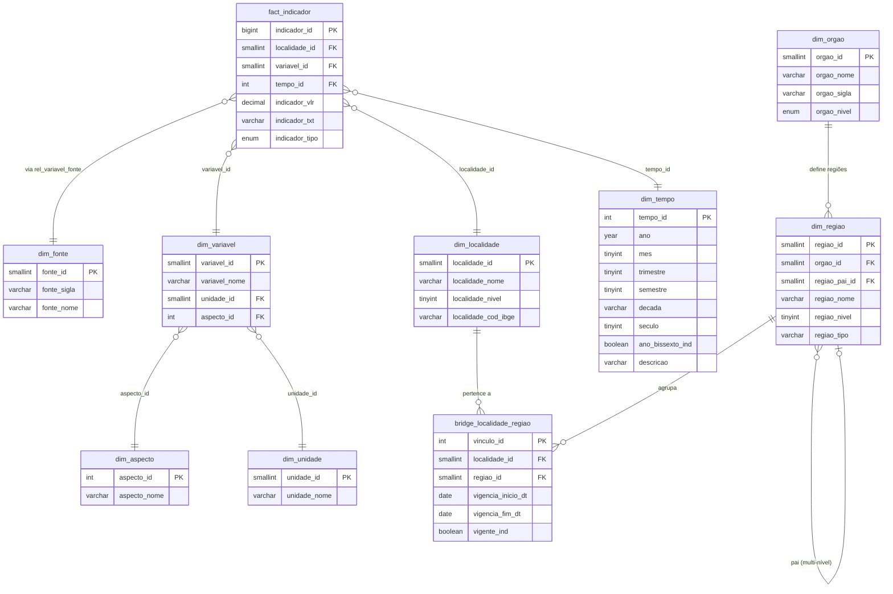

# 📊 BDE — Refatoração para Data Warehouse

Projeto de refatoração do banco de dados **`imp`** (MySQL 8.4) de uma estrutura relacional convencional para um **Data Warehouse** com modelo estrela (Star Schema).

---

## 🎯 Objetivo

Transformar um banco com **23 tabelas**, **306.372 registros** e **zero integridade referencial** (0 PKs, 0 FKs) em um Data Warehouse organizado, padronizado e com integridade referencial completa.

### Antes x Depois

| Aspecto | Antes | Depois |
| --------- | ------- | -------- |
| Prefixos | `tb_` para tudo | `dim_`, `fact_`, `rel_`, `aux_`, `cfg_`, `log_`, `bridge_` |
| Nomenclatura | Inconsistente (`Cod_loc`, `PtoX`, `var_asp`) | `snake_case` padronizado |
| Chaves primárias | 0 | 16+ |
| Chaves estrangeiras | 0 | 15+ |
| Tabela fato | Colunar (`d_1980`…`d_2030`) | Normalizada (1 linha por indicador/local/ano) |
| Tipos de dados | Tudo `VARCHAR` | `DECIMAL`, `SMALLINT`, `TINYINT`, `ENUM` |
| Regiões | Colunas fixas (3 tipos) | Dinâmicas por órgão + histórico (SCD Tipo 2) |

---

## 🏗️ Estrutura do Projeto

```folder
bde/
├── conexao_mysql.py               # Utilitário de conexão ao banco
├── validar_refatoracao.py         # Validação automática da estrutura (v3.0)
├── analisar_dados_migracao.py     # Análise de qualidade dos dados (v2.0)
│
├── script_padronizacao_nomenclatura.sql  # Renomeação + criação de estruturas
├── funcao_conversao_dados.sql            # Funções de conversão + migração
├── migrar_dados_regioes.sql              # Migração de dados para modelo de regiões
│
├── padrao_nomenclatura.md                # Padrão de nomenclatura (de-para)
├── RELATORIO_ANALISE_DADOS.md            # Relatório de qualidade dos dados
├── MODELO_REGIOES_TRABALHO.md            # Evolução: regiões por órgão (Snowflake + SCD2)
├── HANDSON_MIGRACAO_DATAWAREHOUSE.md     # Guia prático para a equipe (~9h30)
│
└── venv/                          # Ambiente virtual Python
```

---

## ⚙️ Ambiente

| Componente | Detalhes |
| ------------ | ---------- |
| **MySQL** | 8.4 (Docker) — porta `3306` |
| **Python** | 3.10+ com `mysql-connector-python` |
| **SSL** | Desabilitado (`useSSL=false`) |

---

## 🚀 Início Rápido

### 1. Configurar o Python

```bash
python -m venv venv

# Windows PowerShell
.\venv\Scripts\Activate.ps1

# Linux/Mac
source venv/bin/activate

pip install mysql-connector-python
```

### 2. Testar conexão

```bash
python conexao_mysql.py
```

### 3. Executar validação

```bash
python validar_refatoracao.py
```

---

## 📋 Fases de Implementação

| # | Fase | Descrição | Prioridade |
| --- | ------ | ----------- | ------------ |
| 1 | **Backup** | Backup completo do banco original | 🔴 Crítica |
| 2 | **Limpeza** | Resolver duplicatas e registros órfãos | 🔴 Crítica |
| 3 | **Nomenclatura** | Renomear tabelas e colunas | 🟡 Alta |
| 4 | **Migração** | Normalizar tabela fato + conversão de dados | 🟡 Alta |
| 5 | **Integridade** | Criar PKs e FKs | 🟡 Alta |
| 6 | **Regiões** | Modelo Snowflake de regiões por órgão + SCD Tipo 2 | 🟡 Alta |
| 7 | **Documentação** | Validação final e documentação | 🟢 Normal |

> 📖 Detalhes completos em `CRONOGRAMA_IMPLEMENTACAO.md`  
> 🛠️ Guia prático em `HANDSON_MIGRACAO_DATAWAREHOUSE.md`

---

## 🔍 Descobertas da Análise de Dados

A tabela `tb_dados` (futura `fact_indicador`) armazena **todos os valores como VARCHAR**. A análise revelou:

| Formato | % | Exemplo |
| --------- | --- | --------- |
| Inteiros | 49,35% | `3`, `12`, `4590` |
| Hífens (`-` = NULL) | 45,88% | `-` |
| Decimal com vírgula | 2,69% | `0,56` |
| Decimal com ponto | 1,89% | `1.496` |
| Texto especial | 0,09% | `[1]` |
| Formato BR completo | 0,07% | `1.234.567,89` |
| Texto | 0,01% | `x` |

> 📖 Detalhes em `RELATORIO_ANALISE_DADOS.md`

---

## 🌟 Modelo Estrela com Snowflake Parcial



---

## 📚 Documentação

| Documento | Descrição |
| ----------- | ----------- |
| [`padrao_nomenclatura.md`](padrao_nomenclatura.md) | Convenções de nomenclatura com mapeamento completo de-para |
| [`RELATORIO_ANALISE_DADOS.md`](RELATORIO_ANALISE_DADOS.md) | Análise detalhada dos formatos de dados encontrados |
| [`MODELO_REGIOES_TRABALHO.md`](MODELO_REGIOES_TRABALHO.md) | Evolução do modelo: regiões por órgão (Snowflake + SCD Tipo 2) |
| [`HANDSON_MIGRACAO_DATAWAREHOUSE.md`](HANDSON_MIGRACAO_DATAWAREHOUSE.md) | Guia prático hands-on para a equipe (~9h30, 8 exercícios) |

---

## 🧰 Scripts

| Script | Linguagem | Função |
| -------- | ----------- | -------- |
| `conexao_mysql.py` | Python | Conexão e execução de queries |
| `validar_refatoracao.py` | Python | Validação automática com detecção de nomenclatura |
| `analisar_dados_migracao.py` | Python | Análise de qualidade dos dados |
| `script_padronizacao_nomenclatura.sql` | SQL | Renomeação de tabelas e colunas + criação de estruturas |
| `funcao_conversao_dados.sql` | SQL | Funções de conversão, dim_tempo, fact_indicador, procedure de migração |
| `migrar_dados_regioes.sql` | SQL | Migração de dados para modelo de regiões por órgão |
